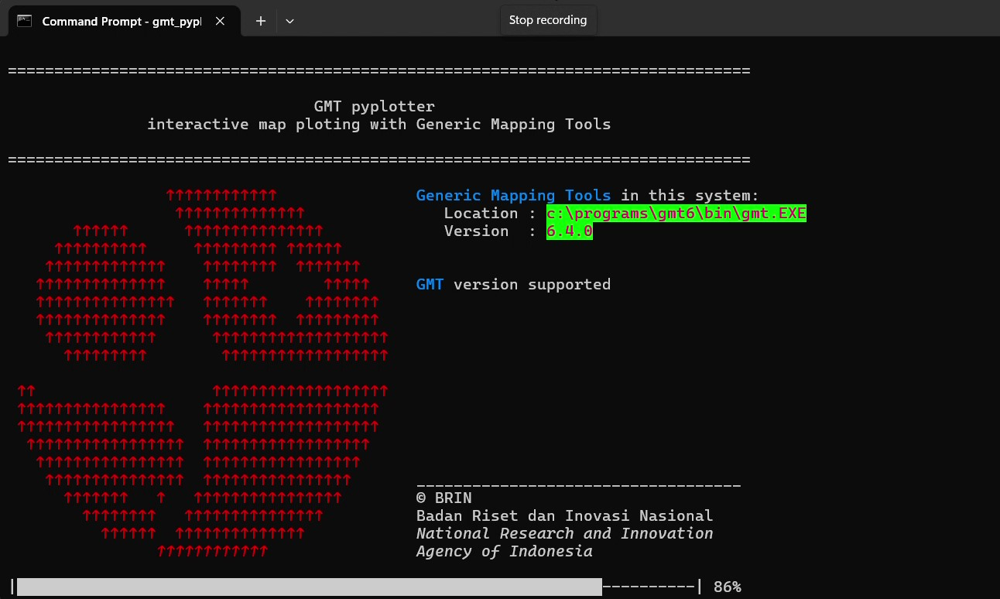

# GMT_Pyplotter

## What is GMT

Generic Mapping Tools (GMT) is an open source collection of about 100 command-line tools for manipulating geographic and Cartesian data sets (including filtering, trend fitting, gridding, projecting, etc.) and producing high-quality illustrations ranging from simple x-y plots via contour maps to artificially illuminated surfaces, 3D perspective views and animations. The GMT supplements add another 50 more specialized and discipline-specific tools. This program can be running either as Command Line Interface (CLI) or as a script code.

### Complication

* not beginer friendly
* steep learning curve with the GMT
* Prone typing error when inputing commands or parameters
* time consuming when creating the script (trial and error)

## GMT_Pyplotter

Just type the parameters, the program will generate and download the requested data for you.

Run interactively in command line interface with input validation, no need to worries to the error.

Working on Windows, Linux or macOS

If the output not as expected, re-run the gmt_pyplotter.

### How it's work

In the begining of the script, the GMT program is check for the installation location and the version match the required specification.

Follow the instruction for installing required application.

1. In the begining, select a directory for output (map and another additional data)
2. Then select the output format (jpg, png, eps, pdf, etc..)
3. Pick a name for the map
4. input the general info such as map projection, map width, and coordinate.
5. Select layers and then generate the map.

### Available layers

1. Coastal line
2. Earth relief
3. Contour line
4. Earthquake plot
5. Focal Mechanism plot
6. Indonesia regional tectonic plot
7. Map inset

### How to use

In the terminal or cmd/powershell type the command:

```python
gmt_pyplotter
```

Then input the required parameter based on the map to be generate

## Requirements

* gawk or gnuwin32
* Generic Mapping Tools >=6.4.0
* Python version >= 3.10

## Installation

1. Make sure the required apps already installed or the apps will guide the required external programs
2. Open terminal (linux or macOS) or cmd / powershell (Windows operating system)
3. Change directory to the directory of  installer where there is setup.py exist,  and enter the following command:

```python
pip install .
```

## License

Copyright (c) 2024 by *BRIN* (*Badan Riset dan Inovasi Nasional* / National Research and Innovation Agency of Indonesia)
